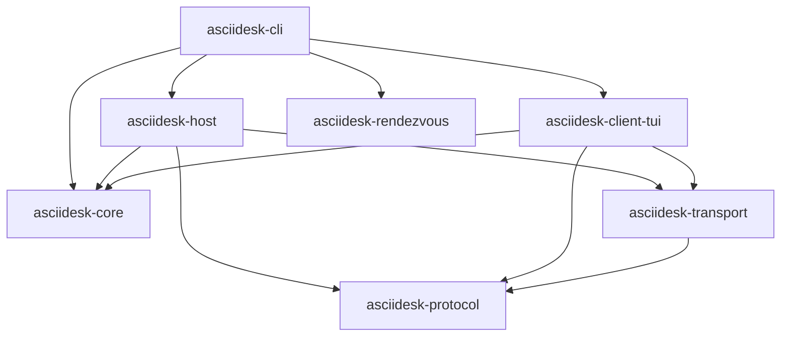

# ASCIIDesk Architecture

This document describes the structure and module dependencies of the ASCIIDesk Cargo workspace.

---

## 1. System Block Diagram

---

## 2. Crate Layout

The project is structured as a Rust Cargo Workspace to enforce boundary segregation:

### `crates/asciidesk-core`
*   **Purpose**: Shared utilities, local storage management, and device identity.
*   **Key Responsibilities**:
    *   Loading and saving config files (using `dirs` crate to locate OS config directories).
    *   Generating/loading Ed25519 identity keypairs.
    *   Managing the local trust store JSON.
    *   Recording session history inside an audit log.

### `crates/asciidesk-protocol`
*   **Purpose**: Protocol message types, negotiation parameters, and capabilities enums.
*   **Key Responsibilities**:
    *   Defining version-controlled schemas for `ClientToHost` and `HostToClient` messages.
    *   Defining supported capabilities (e.g., terminal resize, PTY capture, keyboard events).
    *   Providing serialization and deserialization helpers.

### `crates/asciidesk-transport`
*   **Purpose**: Low-level WebSocket connections and connection life cycle.
*   **Key Responsibilities**:
    *   Wrapping `tokio-tungstenite` streams.
    *   Implementing heartbeat timers (ping/pong) to identify broken connections.
    *   Exposing traits for reading and writing protocol frames.

### `crates/asciidesk-host`
*   **Purpose**: Spawns and manages shell processes, asks for user consent, and forwards I/O.
*   **Key Responsibilities**:
    *   Listening for incoming connections on TCP/WebSockets.
    *   Checking authorization (pairing code verification or trusted fingerprint lookup).
    *   Interactively prompting local host users for connection approval.
    *   Interfacing with the operating system PTY (using `portable-pty`).
    *   Piping terminal stdout to the network and writing network inputs to the shell.

### `crates/asciidesk-client-tui`
*   **Purpose**: Terminal user interface for the client.
*   **Key Responsibilities**:
    *   Establishing connection to the host.
    *   Enabling raw terminal mode on the client shell.
    *   Drawing remote PTY buffers and ANSI terminal escape codes.
    *   Listening for local keypresses and window resizes and transmitting them.
    *   Gracefully restoring terminal states on exit.

### `crates/asciidesk-rendezvous`
*   **Purpose**: Brokering metadata to coordinate connections behind NATs.
*   **Key Responsibilities**:
    *   Maintaining ephemeral in-memory pairing data.
    *   Validating pairing codes and matching client/host connection candidates.

### `crates/asciidesk-cli`
*   **Purpose**: Unified entrypoint containing the executable binary.
*   **Key Responsibilities**:
    *   Parsing CLI flags using `clap`.
    *   Providing subcommands: `host`, `client`, `pair`, `trust`, `devices`, `doctor`, and `rendezvous`.
    *   Configuring the global tracing subscriber.
